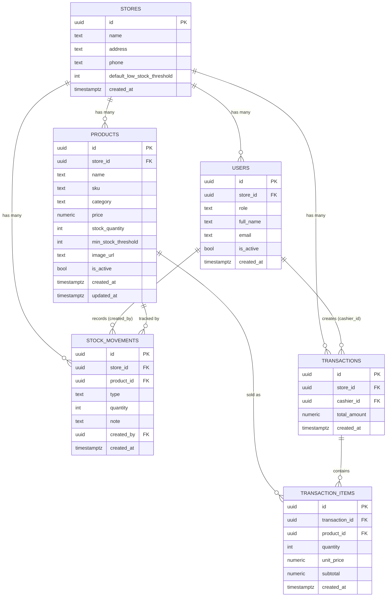

# Part 3 — Database Design

**Target:** Supabase PostgreSQL
**Consistency rule:** Every table below directly implements a Business Rule (BR-xx) or Functional Requirement (FR-xx) from Part 1. Where a column exists purely for ML feature engineering or auditability, that is called out explicitly so the API (Part 5) and ML service (Part 6) can be designed against it without contradiction.

---

## 3.1 Entity Overview

| Entity | Purpose | Implements |
|---|---|---|
| `stores` | Tenant root — one row per SME/UMKM business account | BR-01, BR-02 |
| `users` | Profile extending Supabase `auth.users`; carries role + tenant scope | FR-01, FR-02, BR-05, BR-07 |
| `products` | Product catalog, current stock cache, pricing | FR-03, FR-04, BR-09, BR-11, BR-22 |
| `stock_movements` | Append-only audit log of every stock change; **also the ML training source** | FR-05, FR-06, BR-08 |
| `transactions` | One row per completed sale (POS header) | FR-07, BR-03, BR-04 |
| `transaction_items` | Line items per transaction, with price snapshot | FR-09, BR-03, BR-22 |

`ml_predictions` is intentionally **not** a table in v1 — predictions are computed on-demand and not persisted (BR-19). It is documented in Part 6 as a future-enhancement schema only.

---

## 3.2 Entity Relationship Diagram (ERD)



---

## 3.3 Relationship Schema (Cardinalities & Referential Behavior)

| Relationship | Cardinality | ON DELETE | Justification |
|---|---|---|---|
| `stores` → `users` | 1 : N | `RESTRICT` (on `users.store_id`) | A store cannot be deleted while users still belong to it — forces explicit user offboarding first, preventing orphaned auth identities. |
| `stores` → `products` | 1 : N | `CASCADE` | Deleting a store (rare, admin-only operation) should remove its catalog; in practice products are soft-deleted (BR-22) long before a store is ever hard-deleted. |
| `stores` → `stock_movements` | 1 : N | `CASCADE` | Movement log is meaningless without its owning store. |
| `stores` → `transactions` | 1 : N | `CASCADE` | Same rationale; in practice never exercised since transactions are immutable history. |
| `users` → `stock_movements` (`created_by`) | 1 : N | `RESTRICT`(implicit, no cascade) — see note | A stock movement must always be attributable to the user who made it; `RESTRICT` is the default Postgres behavior when no `ON DELETE` clause is given, which is intentional here so historical audit attribution is never silently lost. |
| `users` → `transactions` (`cashier_id`) | 1 : N | `RESTRICT`(default) | Same audit-integrity rationale — a cashier's sales history must remain attributable even if the account is later deactivated (note: deactivation uses `is_active = false`, not deletion — see §3.7). |
| `products` → `stock_movements` | 1 : N | `CASCADE` | A movement log entry cannot outlive its product. |
| `products` → `transaction_items` | 1 : N | `RESTRICT` | **Critical rule:** a product that has ever been sold can never be hard-deleted, because `transaction_items` is historical financial record. This is why products use soft delete (`is_active`) exclusively — the FK constraint enforces it at the database level, not just by convention. |
| `transactions` → `transaction_items` | 1 : N | `CASCADE` | Line items have no independent existence outside their parent transaction. |

---

## 3.4 Normalization Analysis

**1NF:** All columns hold atomic, single-valued data (e.g., no comma-separated category lists, no arrays of items inside `transactions`). The line-item array of a sale is correctly decomposed into the separate `transaction_items` table rather than stored as JSON inside `transactions` — satisfying 1NF instead of taking the easier but non-normalized shortcut.

**2NF:** Every table uses a single-column surrogate key (`uuid`), so there is no composite primary key and therefore no possibility of a partial functional dependency. 2NF is satisfied trivially and structurally, not just by inspection.

**3NF — and two deliberate, documented exceptions:**
All non-key columns depend only on their table's primary key, with two intentional denormalizations kept for performance and auditability reasons rather than oversight:

1. `transaction_items.subtotal` is functionally derivable from `quantity × unit_price`, which is a transitive dependency that strict 3NF would eliminate. It is kept as a stored column because: (a) it is written once at transaction time and never updated (transactions are immutable, BR-04), so there is no update-anomaly risk; (b) it avoids recomputing aggregates on every report query (FR-10); (c) it preserves the *exact* amount charged even if rounding rules around `price × quantity` were ever revised later.
2. `products.stock_quantity` is a maintained cache of what could otherwise be derived as `SUM(stock_movements.quantity WHERE type='IN') − SUM(stock_movements.quantity WHERE type='OUT')` for that product. It is kept as a live column because stock checks happen on every single sale (FR-08) and must be O(1), not an aggregate scan over the entire movement history. `stock_movements` remains the append-only source of truth/audit trail (and the ML training source); `products.stock_quantity` is kept consistent with it transactionally inside `fn_create_sale_transaction` (§3.6) and via stock-in/adjustment endpoints — never updated independently by the client.

Both exceptions are standard, defensible denormalization-for-performance patterns and are called out explicitly here so they are not mistaken for a missed normalization step during review.

---

## 3.5 Full Table Specification

### `stores`
| Column | Type | Constraints |
|---|---|---|
| `id` | `uuid` | PK, `DEFAULT gen_random_uuid()` |
| `name` | `text` | `NOT NULL` |
| `address` | `text` | nullable |
| `phone` | `text` | nullable |
| `default_low_stock_threshold` | `integer` | `NOT NULL DEFAULT 5`, `CHECK (default_low_stock_threshold >= 0)` — store-level fallback per BR-11 |
| `created_at` | `timestamptz` | `NOT NULL DEFAULT now()` |

### `users`
| Column | Type | Constraints |
|---|---|---|
| `id` | `uuid` | PK, FK → `auth.users(id)` `ON DELETE CASCADE` |
| `store_id` | `uuid` | `NOT NULL`, FK → `stores(id)` `ON DELETE RESTRICT` |
| `role` | `text` | `NOT NULL`, `CHECK (role IN ('admin','cashier'))` |
| `full_name` | `text` | `NOT NULL` |
| `email` | `text` | `NOT NULL`, `UNIQUE` |
| `is_active` | `boolean` | `NOT NULL DEFAULT true` |
| `created_at` | `timestamptz` | `NOT NULL DEFAULT now()` |
**Indexes:** `idx_users_store_id (store_id)`, `idx_users_store_role (store_id, role)`

### `products`
| Column | Type | Constraints |
|---|---|---|
| `id` | `uuid` | PK, `DEFAULT gen_random_uuid()` |
| `store_id` | `uuid` | `NOT NULL`, FK → `stores(id)` `ON DELETE CASCADE` |
| `name` | `text` | `NOT NULL` |
| `sku` | `text` | `NOT NULL` |
| `category` | `text` | nullable |
| `price` | `numeric(12,2)` | `NOT NULL`, `CHECK (price >= 0)` |
| `stock_quantity` | `integer` | `NOT NULL DEFAULT 0`, `CHECK (stock_quantity >= 0)` — NFR-08 backstop |
| `min_stock_threshold` | `integer` | nullable, `CHECK (min_stock_threshold IS NULL OR min_stock_threshold >= 0)` |
| `image_url` | `text` | nullable — Supabase Storage public/signed URL |
| `is_active` | `boolean` | `NOT NULL DEFAULT true` — soft delete, BR-22 |
| `created_at` | `timestamptz` | `NOT NULL DEFAULT now()` |
| `updated_at` | `timestamptz` | `NOT NULL DEFAULT now()` — maintained by trigger, §3.6 |
**Constraints:** `UNIQUE (store_id, sku)` — SKU uniqueness is per-tenant, not global.
**Indexes:** `idx_products_store_id (store_id)`, `idx_products_store_active (store_id, is_active)`, `idx_products_store_category (store_id, category)`

### `stock_movements`
| Column | Type | Constraints |
|---|---|---|
| `id` | `uuid` | PK, `DEFAULT gen_random_uuid()` |
| `store_id` | `uuid` | `NOT NULL`, FK → `stores(id)` `ON DELETE CASCADE` |
| `product_id` | `uuid` | `NOT NULL`, FK → `products(id)` `ON DELETE CASCADE` |
| `type` | `text` | `NOT NULL`, `CHECK (type IN ('IN','OUT','ADJUSTMENT'))` |
| `quantity` | `integer` | `NOT NULL`, `CHECK (quantity > 0)` — direction is carried by `type`, magnitude is always positive |
| `note` | `text` | nullable |
| `created_by` | `uuid` | `NOT NULL`, FK → `users(id)` |
| `created_at` | `timestamptz` | `NOT NULL DEFAULT now()` |
**Indexes:** `idx_stock_movements_product_created (product_id, created_at)` — **performance-critical**: this is the exact access pattern the ML service needs (per-product time series, ordered by date) for moving averages and feature engineering (Part 6); `idx_stock_movements_store_id (store_id)`

### `transactions`
| Column | Type | Constraints |
|---|---|---|
| `id` | `uuid` | PK, `DEFAULT gen_random_uuid()` |
| `store_id` | `uuid` | `NOT NULL`, FK → `stores(id)` `ON DELETE CASCADE` |
| `cashier_id` | `uuid` | `NOT NULL`, FK → `users(id)` |
| `total_amount` | `numeric(14,2)` | `NOT NULL DEFAULT 0`, `CHECK (total_amount >= 0)` |
| `created_at` | `timestamptz` | `NOT NULL DEFAULT now()` |
**No `updated_at`** — transactions are immutable (BR-04); there is nothing to update.
**Indexes:** `idx_transactions_store_created (store_id, created_at)` — primary access pattern for reports (FR-10)

### `transaction_items`
| Column | Type | Constraints |
|---|---|---|
| `id` | `uuid` | PK, `DEFAULT gen_random_uuid()` |
| `transaction_id` | `uuid` | `NOT NULL`, FK → `transactions(id)` `ON DELETE CASCADE` |
| `product_id` | `uuid` | `NOT NULL`, FK → `products(id)` `ON DELETE RESTRICT` |
| `quantity` | `integer` | `NOT NULL`, `CHECK (quantity > 0)` |
| `unit_price` | `numeric(12,2)` | `NOT NULL`, `CHECK (unit_price >= 0)` — price snapshot, FR-09 |
| `subtotal` | `numeric(14,2)` | `NOT NULL`, `CHECK (subtotal >= 0)` |
| `created_at` | `timestamptz` | `NOT NULL DEFAULT now()` |
**Indexes:** `idx_transaction_items_transaction_id (transaction_id)`, `idx_transaction_items_product_id (product_id)` — combined with `transactions(store_id, created_at)`, this supports the join needed to build per-product daily sales history for ML feature engineering (`historical_sales`, `sales_7d_avg`, `sales_14d_avg`).

---

## 3.6 SQL Schema (Supabase PostgreSQL — Runnable DDL)

```sql
-- ============================================================
-- EXTENSIONS
-- ============================================================
CREATE EXTENSION IF NOT EXISTS pgcrypto; -- gen_random_uuid()

-- ============================================================
-- TABLE: stores
-- ============================================================
CREATE TABLE stores (
    id                              uuid PRIMARY KEY DEFAULT gen_random_uuid(),
    name                            text NOT NULL,
    address                         text,
    phone                           text,
    default_low_stock_threshold     integer NOT NULL DEFAULT 5
        CHECK (default_low_stock_threshold >= 0),
    created_at                      timestamptz NOT NULL DEFAULT now()
);

-- ============================================================
-- TABLE: users (profile extending Supabase auth.users)
-- ============================================================
CREATE TABLE users (
    id          uuid PRIMARY KEY REFERENCES auth.users(id) ON DELETE CASCADE,
    store_id    uuid NOT NULL REFERENCES stores(id) ON DELETE RESTRICT,
    role        text NOT NULL CHECK (role IN ('admin', 'cashier')),
    full_name   text NOT NULL,
    email       text NOT NULL UNIQUE,
    is_active   boolean NOT NULL DEFAULT true,
    created_at  timestamptz NOT NULL DEFAULT now()
);

CREATE INDEX idx_users_store_id ON users (store_id);
CREATE INDEX idx_users_store_role ON users (store_id, role);

-- ============================================================
-- TABLE: products
-- ============================================================
CREATE TABLE products (
    id                  uuid PRIMARY KEY DEFAULT gen_random_uuid(),
    store_id            uuid NOT NULL REFERENCES stores(id) ON DELETE CASCADE,
    name                text NOT NULL,
    sku                 text NOT NULL,
    category            text,
    price               numeric(12,2) NOT NULL CHECK (price >= 0),
    stock_quantity      integer NOT NULL DEFAULT 0 CHECK (stock_quantity >= 0),
    min_stock_threshold integer CHECK (min_stock_threshold IS NULL OR min_stock_threshold >= 0),
    image_url           text,
    is_active           boolean NOT NULL DEFAULT true,
    created_at          timestamptz NOT NULL DEFAULT now(),
    updated_at          timestamptz NOT NULL DEFAULT now(),
    CONSTRAINT uq_products_store_sku UNIQUE (store_id, sku)
);

CREATE INDEX idx_products_store_id ON products (store_id);
CREATE INDEX idx_products_store_active ON products (store_id, is_active);
CREATE INDEX idx_products_store_category ON products (store_id, category);

-- ============================================================
-- TABLE: stock_movements (append-only audit + ML source)
-- ============================================================
CREATE TABLE stock_movements (
    id          uuid PRIMARY KEY DEFAULT gen_random_uuid(),
    store_id    uuid NOT NULL REFERENCES stores(id) ON DELETE CASCADE,
    product_id  uuid NOT NULL REFERENCES products(id) ON DELETE CASCADE,
    type        text NOT NULL CHECK (type IN ('IN', 'OUT', 'ADJUSTMENT')),
    quantity    integer NOT NULL CHECK (quantity > 0),
    note        text,
    created_by  uuid NOT NULL REFERENCES users(id),
    created_at  timestamptz NOT NULL DEFAULT now()
);

CREATE INDEX idx_stock_movements_product_created ON stock_movements (product_id, created_at);
CREATE INDEX idx_stock_movements_store_id ON stock_movements (store_id);

-- ============================================================
-- TABLE: transactions (immutable POS header)
-- ============================================================
CREATE TABLE transactions (
    id            uuid PRIMARY KEY DEFAULT gen_random_uuid(),
    store_id      uuid NOT NULL REFERENCES stores(id) ON DELETE CASCADE,
    cashier_id    uuid NOT NULL REFERENCES users(id),
    total_amount  numeric(14,2) NOT NULL DEFAULT 0 CHECK (total_amount >= 0),
    created_at    timestamptz NOT NULL DEFAULT now()
);

CREATE INDEX idx_transactions_store_created ON transactions (store_id, created_at);

-- ============================================================
-- TABLE: transaction_items (line items, price snapshot)
-- ============================================================
CREATE TABLE transaction_items (
    id              uuid PRIMARY KEY DEFAULT gen_random_uuid(),
    transaction_id  uuid NOT NULL REFERENCES transactions(id) ON DELETE CASCADE,
    product_id      uuid NOT NULL REFERENCES products(id) ON DELETE RESTRICT,
    quantity        integer NOT NULL CHECK (quantity > 0),
    unit_price      numeric(12,2) NOT NULL CHECK (unit_price >= 0),
    subtotal        numeric(14,2) NOT NULL CHECK (subtotal >= 0),
    created_at      timestamptz NOT NULL DEFAULT now()
);

CREATE INDEX idx_transaction_items_transaction_id ON transaction_items (transaction_id);
CREATE INDEX idx_transaction_items_product_id ON transaction_items (product_id);

-- ============================================================
-- TRIGGER: auto-update products.updated_at
-- ============================================================
CREATE OR REPLACE FUNCTION fn_set_updated_at()
RETURNS TRIGGER AS $$
BEGIN
    NEW.updated_at = now();
    RETURN NEW;
END;
$$ LANGUAGE plpgsql;

CREATE TRIGGER trg_products_updated_at
    BEFORE UPDATE ON products
    FOR EACH ROW
    EXECUTE FUNCTION fn_set_updated_at();

-- ============================================================
-- FUNCTION: fn_create_sale_transaction
-- Atomic POS checkout — implements FR-08, FR-09, NFR-08.
-- Runs as ONE database transaction with row-level locking
-- (SELECT ... FOR UPDATE) so concurrent cashiers cannot both
-- oversell the same product. Called by Express via Supabase RPC
-- instead of separate INSERT/UPDATE calls, eliminating the
-- race-condition window that pure application-layer checks
-- cannot fully close.
-- ============================================================
CREATE OR REPLACE FUNCTION fn_create_sale_transaction(
    p_store_id   uuid,
    p_cashier_id uuid,
    p_items      jsonb  -- format: [{"product_id": "...", "quantity": 2}, ...]
) RETURNS uuid AS $$
DECLARE
    v_transaction_id uuid;
    v_item           jsonb;
    v_product_id     uuid;
    v_quantity       integer;
    v_price          numeric(12,2);
    v_stock          integer;
    v_subtotal       numeric(14,2);
    v_total          numeric(14,2) := 0;
BEGIN
    INSERT INTO transactions (store_id, cashier_id, total_amount)
    VALUES (p_store_id, p_cashier_id, 0)
    RETURNING id INTO v_transaction_id;

    FOR v_item IN SELECT * FROM jsonb_array_elements(p_items)
    LOOP
        v_product_id := (v_item ->> 'product_id')::uuid;
        v_quantity   := (v_item ->> 'quantity')::integer;

        IF v_quantity IS NULL OR v_quantity <= 0 THEN
            RAISE EXCEPTION 'INVALID_QUANTITY: product % quantity must be > 0', v_product_id;
        END IF;

        -- Row lock prevents two concurrent sales from both passing the stock check
        SELECT price, stock_quantity INTO v_price, v_stock
        FROM products
        WHERE id = v_product_id AND store_id = p_store_id
        FOR UPDATE;

        IF v_price IS NULL THEN
            RAISE EXCEPTION 'PRODUCT_NOT_FOUND: %', v_product_id;
        END IF;

        IF v_stock < v_quantity THEN
            RAISE EXCEPTION 'INSUFFICIENT_STOCK: product % requested % available %',
                v_product_id, v_quantity, v_stock;
        END IF;

        v_subtotal := v_price * v_quantity;
        v_total    := v_total + v_subtotal;

        INSERT INTO transaction_items (transaction_id, product_id, quantity, unit_price, subtotal)
        VALUES (v_transaction_id, v_product_id, v_quantity, v_price, v_subtotal);

        UPDATE products
        SET stock_quantity = stock_quantity - v_quantity
        WHERE id = v_product_id;

        INSERT INTO stock_movements (store_id, product_id, type, quantity, note, created_by)
        VALUES (p_store_id, v_product_id, 'OUT', v_quantity,
                'Sale via transaction ' || v_transaction_id, p_cashier_id);
    END LOOP;

    UPDATE transactions SET total_amount = v_total WHERE id = v_transaction_id;

    RETURN v_transaction_id;
END;
$$ LANGUAGE plpgsql;

-- Any RAISE EXCEPTION above rolls back the entire function automatically,
-- including the transaction header insert — satisfying FR-08's
-- "reject the whole transaction" requirement with zero partial writes.

-- ============================================================
-- ROW LEVEL SECURITY (defense-in-depth — see BR-05)
-- Primary enforcement is Express RBAC middleware using the
-- service-role key (which bypasses RLS). These policies protect
-- against any future direct client-side Supabase access.
-- ============================================================
ALTER TABLE products ENABLE ROW LEVEL SECURITY;
ALTER TABLE stock_movements ENABLE ROW LEVEL SECURITY;
ALTER TABLE transactions ENABLE ROW LEVEL SECURITY;
ALTER TABLE transaction_items ENABLE ROW LEVEL SECURITY;
ALTER TABLE users ENABLE ROW LEVEL SECURITY;

CREATE POLICY tenant_isolation_products ON products
    FOR ALL USING (store_id = (SELECT store_id FROM users WHERE id = auth.uid()));

CREATE POLICY tenant_isolation_stock_movements ON stock_movements
    FOR ALL USING (store_id = (SELECT store_id FROM users WHERE id = auth.uid()));

CREATE POLICY tenant_isolation_transactions ON transactions
    FOR ALL USING (store_id = (SELECT store_id FROM users WHERE id = auth.uid()));

CREATE POLICY tenant_isolation_transaction_items ON transaction_items
    FOR ALL USING (
        transaction_id IN (
            SELECT id FROM transactions
            WHERE store_id = (SELECT store_id FROM users WHERE id = auth.uid())
        )
    );

CREATE POLICY self_or_same_store_users ON users
    FOR SELECT USING (
        id = auth.uid()
        OR store_id = (SELECT store_id FROM users WHERE id = auth.uid())
    );
```

---

## 3.7 Notes Carried Forward to Later Parts

- **Part 5 (API):** every endpoint's query filter must include `WHERE store_id = :authenticatedUserStoreId` even though RLS exists as a backstop — this is restated explicitly in the API spec so it isn't accidentally dropped.
- **Part 5 (API) — checkout endpoint:** `POST /api/v1/transactions` must call `fn_create_sale_transaction` via `supabase.rpc(...)`, not perform manual multi-step inserts, to preserve the atomicity guarantee designed above.
- **Part 6 (ML):** feature engineering reads from `stock_movements` (type = `OUT`, joined conceptually to sales) and/or `transaction_items` joined to `transactions.created_at` for the per-day sales series — both paths are index-supported as designed in §3.5.
- **User deactivation** uses `users.is_active = false`, never a row delete — this is what makes the `RESTRICT`-by-default FKs on `created_by`/`cashier_id` safe: the user row always still exists to satisfy the FK, it's simply flagged inactive and blocked from logging in by the Service Layer.

---

**End of Part 3.**

Next: **Part 4 — UML Diagrams** (Use Case, Sequence — including the Transaction and ML Prediction flows, Activity, Class, Deployment), each with Mermaid code and importable draw.io XML.

Reply "continue" to proceed.
