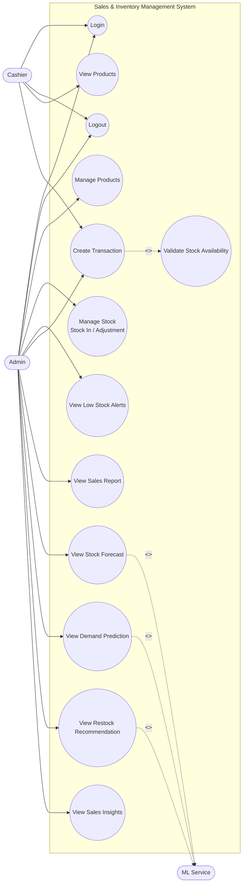
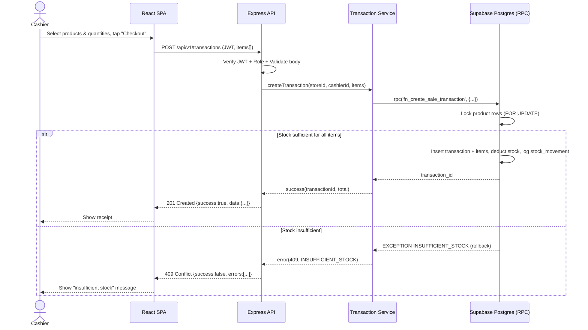
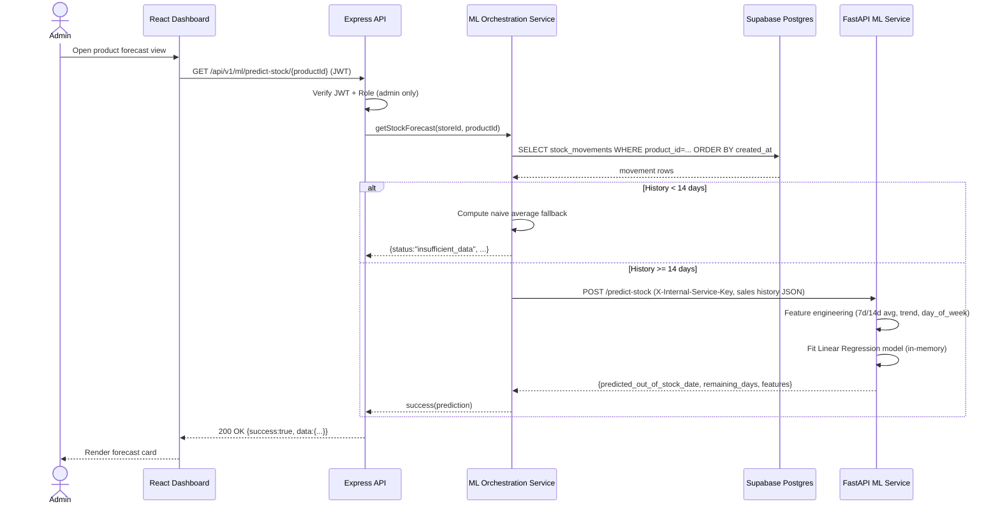
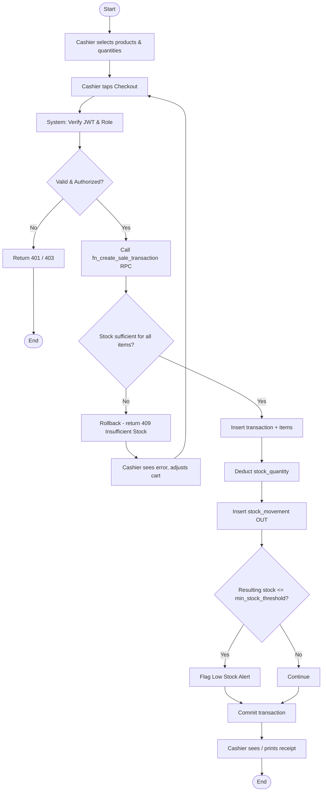
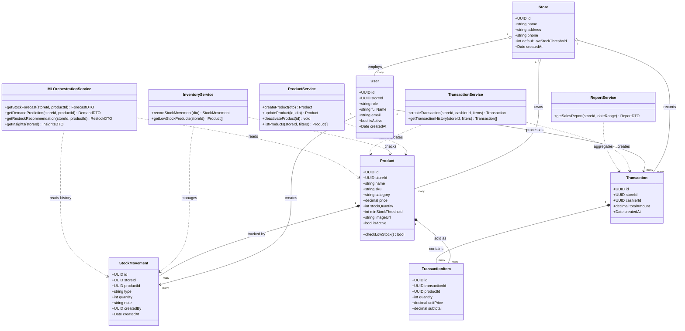
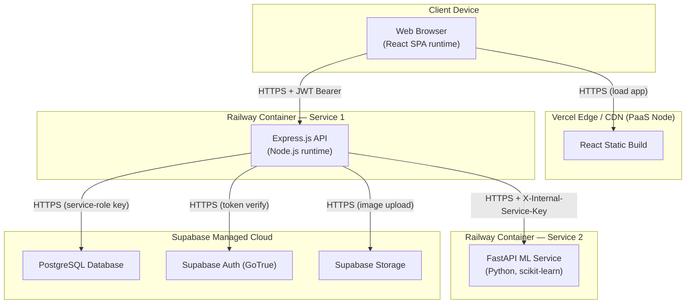

# Part 4 — UML Diagrams

Every diagram below is consistent with Part 1 (requirements), Part 2 (architecture/layers), and Part 3 (schema/SQL function names, table names, column names). Each diagram includes: (1) an explanation, (2) Mermaid code, (3) importable draw.io XML (paste into draw.io via **Extras → Edit Diagram**, or open the `.drawio` file directly if you save the XML block with a `.drawio` extension).

---

## 4.1 Use Case Diagram

### Explanation
Two human actors (Admin, Cashier) interact with the system. A third, non-human actor, **ML Service**, represents the FastAPI microservice that the system itself invokes to fulfil the forecasting use cases — it is modeled as a secondary actor because, from the use-case perspective, it is an external system the application depends on, not a feature the application implements internally. `Create Transaction` `<<include>>`s `Validate Stock Availability` because stock validation is a mandatory sub-step of every checkout (FR-08), not an optional extension. The three ML-related use cases each `<<include>>` the ML Service actor because, per BR-13, they may short-circuit to a naive-average fallback without ever calling it — this is intentionally **not** modeled as `<<extend>>`, since the include represents "this use case's flow involves the ML Service," with the conditional fallback being an internal detail covered in the Sequence and Activity diagrams instead.

### Mermaid Code


### draw.io XML
```xml
<mxfile host="app.diagrams.net">
  <diagram name="UseCaseDiagram" id="usecase1">
    <mxGraphModel dx="1400" dy="800" grid="1" gridSize="10" guides="1" tooltips="1" connect="1" arrows="1" fold="1" page="1" pageScale="1" pageWidth="1600" pageHeight="1000" math="0" shadow="0">
      <root>
        <mxCell id="0" />
        <mxCell id="1" parent="0" />

        <mxCell id="boundary" value="Sales &amp; Inventory Management System" style="rounded=0;whiteSpace=wrap;html=1;verticalAlign=top;fontStyle=1;fillColor=none;" vertex="1" parent="1">
          <mxGeometry x="280" y="40" width="900" height="760" as="geometry" />
        </mxCell>

        <mxCell id="actorAdmin" value="Admin" style="shape=actor;whiteSpace=wrap;html=1;" vertex="1" parent="1">
          <mxGeometry x="60" y="320" width="40" height="60" as="geometry" />
        </mxCell>
        <mxCell id="actorCashier" value="Cashier" style="shape=actor;whiteSpace=wrap;html=1;" vertex="1" parent="1">
          <mxGeometry x="60" y="560" width="40" height="60" as="geometry" />
        </mxCell>
        <mxCell id="actorML" value="ML Service" style="shape=actor;whiteSpace=wrap;html=1;" vertex="1" parent="1">
          <mxGeometry x="1240" y="160" width="40" height="60" as="geometry" />
        </mxCell>

        <mxCell id="uc1" value="Login" style="ellipse;whiteSpace=wrap;html=1;" vertex="1" parent="1">
          <mxGeometry x="320" y="80" width="140" height="50" as="geometry" />
        </mxCell>
        <mxCell id="uc2" value="Logout" style="ellipse;whiteSpace=wrap;html=1;" vertex="1" parent="1">
          <mxGeometry x="320" y="150" width="140" height="50" as="geometry" />
        </mxCell>
        <mxCell id="uc3" value="Manage Products" style="ellipse;whiteSpace=wrap;html=1;" vertex="1" parent="1">
          <mxGeometry x="320" y="220" width="140" height="50" as="geometry" />
        </mxCell>
        <mxCell id="uc4" value="View Products" style="ellipse;whiteSpace=wrap;html=1;" vertex="1" parent="1">
          <mxGeometry x="320" y="290" width="140" height="50" as="geometry" />
        </mxCell>
        <mxCell id="uc5" value="Manage Stock (Stock In / Adjustment)" style="ellipse;whiteSpace=wrap;html=1;" vertex="1" parent="1">
          <mxGeometry x="320" y="360" width="160" height="60" as="geometry" />
        </mxCell>
        <mxCell id="uc6" value="View Low Stock Alerts" style="ellipse;whiteSpace=wrap;html=1;" vertex="1" parent="1">
          <mxGeometry x="320" y="440" width="160" height="50" as="geometry" />
        </mxCell>
        <mxCell id="uc7" value="Create Transaction" style="ellipse;whiteSpace=wrap;html=1;" vertex="1" parent="1">
          <mxGeometry x="320" y="510" width="160" height="50" as="geometry" />
        </mxCell>
        <mxCell id="uc8" value="Validate Stock Availability" style="ellipse;whiteSpace=wrap;html=1;" vertex="1" parent="1">
          <mxGeometry x="600" y="510" width="160" height="50" as="geometry" />
        </mxCell>
        <mxCell id="uc9" value="View Sales Report" style="ellipse;whiteSpace=wrap;html=1;" vertex="1" parent="1">
          <mxGeometry x="320" y="580" width="160" height="50" as="geometry" />
        </mxCell>
        <mxCell id="uc10" value="View Stock Forecast" style="ellipse;whiteSpace=wrap;html=1;" vertex="1" parent="1">
          <mxGeometry x="600" y="100" width="160" height="50" as="geometry" />
        </mxCell>
        <mxCell id="uc11" value="View Demand Prediction" style="ellipse;whiteSpace=wrap;html=1;" vertex="1" parent="1">
          <mxGeometry x="600" y="180" width="160" height="50" as="geometry" />
        </mxCell>
        <mxCell id="uc12" value="View Restock Recommendation" style="ellipse;whiteSpace=wrap;html=1;" vertex="1" parent="1">
          <mxGeometry x="600" y="260" width="180" height="50" as="geometry" />
        </mxCell>
        <mxCell id="uc13" value="View Sales Insights" style="ellipse;whiteSpace=wrap;html=1;" vertex="1" parent="1">
          <mxGeometry x="600" y="340" width="160" height="50" as="geometry" />
        </mxCell>

        <mxCell id="e1" style="edgeStyle=none;html=1;" edge="1" parent="1" source="actorAdmin" target="uc1"><mxGeometry relative="1" as="geometry" /></mxCell>
        <mxCell id="e2" style="edgeStyle=none;html=1;" edge="1" parent="1" source="actorAdmin" target="uc2"><mxGeometry relative="1" as="geometry" /></mxCell>
        <mxCell id="e3" style="edgeStyle=none;html=1;" edge="1" parent="1" source="actorAdmin" target="uc3"><mxGeometry relative="1" as="geometry" /></mxCell>
        <mxCell id="e4" style="edgeStyle=none;html=1;" edge="1" parent="1" source="actorAdmin" target="uc5"><mxGeometry relative="1" as="geometry" /></mxCell>
        <mxCell id="e5" style="edgeStyle=none;html=1;" edge="1" parent="1" source="actorAdmin" target="uc6"><mxGeometry relative="1" as="geometry" /></mxCell>
        <mxCell id="e6" style="edgeStyle=none;html=1;" edge="1" parent="1" source="actorAdmin" target="uc7"><mxGeometry relative="1" as="geometry" /></mxCell>
        <mxCell id="e7" style="edgeStyle=none;html=1;" edge="1" parent="1" source="actorAdmin" target="uc9"><mxGeometry relative="1" as="geometry" /></mxCell>
        <mxCell id="e8" style="edgeStyle=none;html=1;" edge="1" parent="1" source="actorAdmin" target="uc10"><mxGeometry relative="1" as="geometry" /></mxCell>
        <mxCell id="e9" style="edgeStyle=none;html=1;" edge="1" parent="1" source="actorAdmin" target="uc11"><mxGeometry relative="1" as="geometry" /></mxCell>
        <mxCell id="e10" style="edgeStyle=none;html=1;" edge="1" parent="1" source="actorAdmin" target="uc12"><mxGeometry relative="1" as="geometry" /></mxCell>
        <mxCell id="e11" style="edgeStyle=none;html=1;" edge="1" parent="1" source="actorAdmin" target="uc13"><mxGeometry relative="1" as="geometry" /></mxCell>

        <mxCell id="e12" style="edgeStyle=none;html=1;" edge="1" parent="1" source="actorCashier" target="uc1"><mxGeometry relative="1" as="geometry" /></mxCell>
        <mxCell id="e13" style="edgeStyle=none;html=1;" edge="1" parent="1" source="actorCashier" target="uc2"><mxGeometry relative="1" as="geometry" /></mxCell>
        <mxCell id="e14" style="edgeStyle=none;html=1;" edge="1" parent="1" source="actorCashier" target="uc4"><mxGeometry relative="1" as="geometry" /></mxCell>
        <mxCell id="e15" style="edgeStyle=none;html=1;" edge="1" parent="1" source="actorCashier" target="uc7"><mxGeometry relative="1" as="geometry" /></mxCell>

        <mxCell id="inc1" value="&lt;&lt;include&gt;&gt;" style="dashed=1;html=1;endArrow=open;" edge="1" parent="1" source="uc7" target="uc8"><mxGeometry relative="1" as="geometry" /></mxCell>
        <mxCell id="inc2" value="&lt;&lt;include&gt;&gt;" style="dashed=1;html=1;endArrow=open;" edge="1" parent="1" source="uc10" target="actorML"><mxGeometry relative="1" as="geometry" /></mxCell>
        <mxCell id="inc3" value="&lt;&lt;include&gt;&gt;" style="dashed=1;html=1;endArrow=open;" edge="1" parent="1" source="uc11" target="actorML"><mxGeometry relative="1" as="geometry" /></mxCell>
        <mxCell id="inc4" value="&lt;&lt;include&gt;&gt;" style="dashed=1;html=1;endArrow=open;" edge="1" parent="1" source="uc12" target="actorML"><mxGeometry relative="1" as="geometry" /></mxCell>
      </root>
    </mxGraphModel>
  </diagram>
</mxfile>
```

---

## 4.2 Sequence Diagram — POS Transaction (Checkout)

### Explanation
This diagram traces FR-07/FR-08/FR-09 end-to-end and is the runtime realization of the `fn_create_sale_transaction` function from Part 3. The key architectural point it demonstrates is that **Express never performs the stock check and the stock deduction as separate round trips** — it delegates the entire operation to a single Postgres RPC call so the database's row lock (`FOR UPDATE`) is what actually prevents two concurrent cashiers from overselling the same product, not application-level optimistic checks.

### Mermaid Code


### draw.io XML
```xml
<mxfile host="app.diagrams.net">
  <diagram name="SequenceTransaction" id="seq1">
    <mxGraphModel dx="1400" dy="900" grid="1" gridSize="10" guides="1" tooltips="1" connect="1" arrows="1" fold="1" page="1" pageScale="1" pageWidth="1200" pageHeight="820" math="0" shadow="0">
      <root>
        <mxCell id="0" />
        <mxCell id="1" parent="0" />

        <mxCell id="hCashier" value="Cashier" style="shape=actor;whiteSpace=wrap;html=1;" vertex="1" parent="1">
          <mxGeometry x="70" y="40" width="40" height="60" as="geometry" />
        </mxCell>
        <mxCell id="hFE" value="React SPA" style="rounded=0;whiteSpace=wrap;html=1;fillColor=#dae8fc;" vertex="1" parent="1">
          <mxGeometry x="220" y="40" width="140" height="40" as="geometry" />
        </mxCell>
        <mxCell id="hAPI" value="Express API" style="rounded=0;whiteSpace=wrap;html=1;fillColor=#ffe6cc;" vertex="1" parent="1">
          <mxGeometry x="440" y="40" width="140" height="40" as="geometry" />
        </mxCell>
        <mxCell id="hSVC" value="Transaction Service" style="rounded=0;whiteSpace=wrap;html=1;fillColor=#ffe6cc;" vertex="1" parent="1">
          <mxGeometry x="660" y="40" width="140" height="40" as="geometry" />
        </mxCell>
        <mxCell id="hDB" value="Supabase Postgres (RPC)" style="rounded=0;whiteSpace=wrap;html=1;fillColor=#d5e8d4;" vertex="1" parent="1">
          <mxGeometry x="880" y="40" width="160" height="40" as="geometry" />
        </mxCell>

        <mxCell id="ll1" style="dashed=1;html=1;endArrow=none;startArrow=none;" edge="1" parent="1">
          <mxGeometry relative="1" as="geometry"><mxPoint x="90" y="100" as="sourcePoint" /><mxPoint x="90" y="760" as="targetPoint" /></mxGeometry>
        </mxCell>
        <mxCell id="ll2" style="dashed=1;html=1;endArrow=none;startArrow=none;" edge="1" parent="1">
          <mxGeometry relative="1" as="geometry"><mxPoint x="290" y="80" as="sourcePoint" /><mxPoint x="290" y="760" as="targetPoint" /></mxGeometry>
        </mxCell>
        <mxCell id="ll3" style="dashed=1;html=1;endArrow=none;startArrow=none;" edge="1" parent="1">
          <mxGeometry relative="1" as="geometry"><mxPoint x="510" y="80" as="sourcePoint" /><mxPoint x="510" y="760" as="targetPoint" /></mxGeometry>
        </mxCell>
        <mxCell id="ll4" style="dashed=1;html=1;endArrow=none;startArrow=none;" edge="1" parent="1">
          <mxGeometry relative="1" as="geometry"><mxPoint x="730" y="80" as="sourcePoint" /><mxPoint x="730" y="760" as="targetPoint" /></mxGeometry>
        </mxCell>
        <mxCell id="ll5" style="dashed=1;html=1;endArrow=none;startArrow=none;" edge="1" parent="1">
          <mxGeometry relative="1" as="geometry"><mxPoint x="960" y="80" as="sourcePoint" /><mxPoint x="960" y="760" as="targetPoint" /></mxGeometry>
        </mxCell>

        <mxCell id="altFrame" value="alt  [stock sufficient]  /  [stock insufficient]" style="rounded=0;whiteSpace=wrap;html=1;verticalAlign=top;align=left;dashed=1;fillColor=none;" vertex="1" parent="1">
          <mxGeometry x="60" y="490" width="1040" height="240" as="geometry" />
        </mxCell>

        <mxCell id="m1" value="1: Select items, tap Checkout" style="html=1;endArrow=block;" edge="1" parent="1">
          <mxGeometry relative="1" as="geometry"><mxPoint x="90" y="120" as="sourcePoint" /><mxPoint x="290" y="120" as="targetPoint" /></mxGeometry>
        </mxCell>
        <mxCell id="m2" value="2: POST /api/v1/transactions" style="html=1;endArrow=block;" edge="1" parent="1">
          <mxGeometry relative="1" as="geometry"><mxPoint x="290" y="190" as="sourcePoint" /><mxPoint x="510" y="190" as="targetPoint" /></mxGeometry>
        </mxCell>
        <mxCell id="note1" value="Verify JWT + Role + Validate body" style="shape=note;whiteSpace=wrap;html=1;fillColor=#fff2cc;size=12;" vertex="1" parent="1">
          <mxGeometry x="520" y="220" width="220" height="40" as="geometry" />
        </mxCell>
        <mxCell id="m3" value="3: createTransaction(storeId, cashierId, items)" style="html=1;endArrow=block;" edge="1" parent="1">
          <mxGeometry relative="1" as="geometry"><mxPoint x="510" y="300" as="sourcePoint" /><mxPoint x="730" y="300" as="targetPoint" /></mxGeometry>
        </mxCell>
        <mxCell id="m4" value="4: rpc('fn_create_sale_transaction', ...)" style="html=1;endArrow=block;" edge="1" parent="1">
          <mxGeometry relative="1" as="geometry"><mxPoint x="730" y="370" as="sourcePoint" /><mxPoint x="960" y="370" as="targetPoint" /></mxGeometry>
        </mxCell>
        <mxCell id="note2" value="Lock rows FOR UPDATE; atomic insert/update" style="shape=note;whiteSpace=wrap;html=1;fillColor=#fff2cc;size=12;" vertex="1" parent="1">
          <mxGeometry x="780" y="400" width="260" height="40" as="geometry" />
        </mxCell>

        <mxCell id="m5" value="5a: transaction_id (success)" style="html=1;endArrow=open;dashed=1;" edge="1" parent="1">
          <mxGeometry relative="1" as="geometry"><mxPoint x="960" y="540" as="sourcePoint" /><mxPoint x="730" y="540" as="targetPoint" /></mxGeometry>
        </mxCell>
        <mxCell id="m6" value="5b: EXCEPTION insufficient_stock (rollback)" style="html=1;endArrow=open;dashed=1;strokeColor=#b85450;" edge="1" parent="1">
          <mxGeometry relative="1" as="geometry"><mxPoint x="960" y="570" as="sourcePoint" /><mxPoint x="730" y="570" as="targetPoint" /></mxGeometry>
        </mxCell>
        <mxCell id="m7" value="6: result (success / 409 error)" style="html=1;endArrow=open;dashed=1;" edge="1" parent="1">
          <mxGeometry relative="1" as="geometry"><mxPoint x="730" y="630" as="sourcePoint" /><mxPoint x="510" y="630" as="targetPoint" /></mxGeometry>
        </mxCell>
        <mxCell id="m8" value="7: 201 Created / 409 Conflict" style="html=1;endArrow=open;dashed=1;" edge="1" parent="1">
          <mxGeometry relative="1" as="geometry"><mxPoint x="510" y="680" as="sourcePoint" /><mxPoint x="290" y="680" as="targetPoint" /></mxGeometry>
        </mxCell>
        <mxCell id="m9" value="8: Show receipt / error message" style="html=1;endArrow=open;dashed=1;" edge="1" parent="1">
          <mxGeometry relative="1" as="geometry"><mxPoint x="290" y="720" as="sourcePoint" /><mxPoint x="90" y="720" as="targetPoint" /></mxGeometry>
        </mxCell>
      </root>
    </mxGraphModel>
  </diagram>
</mxfile>
```

---

## 4.3 Sequence Diagram — ML Prediction Flow

### Explanation
This diagram is the runtime realization of Part 2 §2.6. The decision point that matters academically is step 4: Express checks the **data sufficiency rule (BR-13)** before ever calling FastAPI. This means the ML microservice is not on the critical path for every forecast request — it's bypassed entirely when a product has under 14 days of history, which keeps the contract honest (no model is silently fit on too little data) and saves an unnecessary network hop.

### Mermaid Code


### draw.io XML
```xml
<mxfile host="app.diagrams.net">
  <diagram name="SequenceMLPrediction" id="seq2">
    <mxGraphModel dx="1500" dy="900" grid="1" gridSize="10" guides="1" tooltips="1" connect="1" arrows="1" fold="1" page="1" pageScale="1" pageWidth="1300" pageHeight="900" math="0" shadow="0">
      <root>
        <mxCell id="0" />
        <mxCell id="1" parent="0" />

        <mxCell id="hAdmin" value="Admin" style="shape=actor;whiteSpace=wrap;html=1;" vertex="1" parent="1">
          <mxGeometry x="70" y="40" width="40" height="60" as="geometry" />
        </mxCell>
        <mxCell id="hFE" value="React Dashboard" style="rounded=0;whiteSpace=wrap;html=1;fillColor=#dae8fc;" vertex="1" parent="1">
          <mxGeometry x="220" y="40" width="140" height="40" as="geometry" />
        </mxCell>
        <mxCell id="hAPI" value="Express API" style="rounded=0;whiteSpace=wrap;html=1;fillColor=#ffe6cc;" vertex="1" parent="1">
          <mxGeometry x="440" y="40" width="140" height="40" as="geometry" />
        </mxCell>
        <mxCell id="hSVC" value="ML Orchestration Service" style="rounded=0;whiteSpace=wrap;html=1;fillColor=#ffe6cc;" vertex="1" parent="1">
          <mxGeometry x="660" y="40" width="160" height="40" as="geometry" />
        </mxCell>
        <mxCell id="hDB" value="Supabase Postgres" style="rounded=0;whiteSpace=wrap;html=1;fillColor=#d5e8d4;" vertex="1" parent="1">
          <mxGeometry x="900" y="40" width="150" height="40" as="geometry" />
        </mxCell>
        <mxCell id="hML" value="FastAPI ML Service" style="rounded=0;whiteSpace=wrap;html=1;fillColor=#f8cecc;" vertex="1" parent="1">
          <mxGeometry x="1120" y="40" width="160" height="40" as="geometry" />
        </mxCell>

        <mxCell id="ll1" style="dashed=1;html=1;endArrow=none;startArrow=none;" edge="1" parent="1"><mxGeometry relative="1" as="geometry"><mxPoint x="90" y="100" as="sourcePoint" /><mxPoint x="90" y="820" as="targetPoint" /></mxGeometry></mxCell>
        <mxCell id="ll2" style="dashed=1;html=1;endArrow=none;startArrow=none;" edge="1" parent="1"><mxGeometry relative="1" as="geometry"><mxPoint x="290" y="80" as="sourcePoint" /><mxPoint x="290" y="820" as="targetPoint" /></mxGeometry></mxCell>
        <mxCell id="ll3" style="dashed=1;html=1;endArrow=none;startArrow=none;" edge="1" parent="1"><mxGeometry relative="1" as="geometry"><mxPoint x="510" y="80" as="sourcePoint" /><mxPoint x="510" y="820" as="targetPoint" /></mxGeometry></mxCell>
        <mxCell id="ll4" style="dashed=1;html=1;endArrow=none;startArrow=none;" edge="1" parent="1"><mxGeometry relative="1" as="geometry"><mxPoint x="740" y="80" as="sourcePoint" /><mxPoint x="740" y="820" as="targetPoint" /></mxGeometry></mxCell>
        <mxCell id="ll5" style="dashed=1;html=1;endArrow=none;startArrow=none;" edge="1" parent="1"><mxGeometry relative="1" as="geometry"><mxPoint x="975" y="80" as="sourcePoint" /><mxPoint x="975" y="500" as="targetPoint" /></mxGeometry></mxCell>
        <mxCell id="ll6" style="dashed=1;html=1;endArrow=none;startArrow=none;" edge="1" parent="1"><mxGeometry relative="1" as="geometry"><mxPoint x="1200" y="80" as="sourcePoint" /><mxPoint x="1200" y="700" as="targetPoint" /></mxGeometry></mxCell>

        <mxCell id="altFrame" value="alt  [history &lt; 14 days: naive fallback]  /  [history &gt;= 14 days: call ML service]" style="rounded=0;whiteSpace=wrap;html=1;verticalAlign=top;align=left;dashed=1;fillColor=none;" vertex="1" parent="1">
          <mxGeometry x="60" y="380" width="1240" height="380" as="geometry" />
        </mxCell>

        <mxCell id="m1" value="1: Open product forecast view" style="html=1;endArrow=block;" edge="1" parent="1"><mxGeometry relative="1" as="geometry"><mxPoint x="90" y="120" as="sourcePoint" /><mxPoint x="290" y="120" as="targetPoint" /></mxGeometry></mxCell>
        <mxCell id="m2" value="2: GET /api/v1/ml/predict-stock/{id}" style="html=1;endArrow=block;" edge="1" parent="1"><mxGeometry relative="1" as="geometry"><mxPoint x="290" y="180" as="sourcePoint" /><mxPoint x="510" y="180" as="targetPoint" /></mxGeometry></mxCell>
        <mxCell id="note1" value="Verify JWT + Role (admin only)" style="shape=note;whiteSpace=wrap;html=1;fillColor=#fff2cc;size=12;" vertex="1" parent="1"><mxGeometry x="520" y="210" width="220" height="40" as="geometry" /></mxCell>
        <mxCell id="m3" value="3: getStockForecast(storeId, productId)" style="html=1;endArrow=block;" edge="1" parent="1"><mxGeometry relative="1" as="geometry"><mxPoint x="510" y="280" as="sourcePoint" /><mxPoint x="740" y="280" as="targetPoint" /></mxGeometry></mxCell>
        <mxCell id="m4" value="4: SELECT stock_movements ORDER BY created_at" style="html=1;endArrow=block;" edge="1" parent="1"><mxGeometry relative="1" as="geometry"><mxPoint x="740" y="340" as="sourcePoint" /><mxPoint x="975" y="340" as="targetPoint" /></mxGeometry></mxCell>
        <mxCell id="m5" value="5: movement rows" style="html=1;endArrow=open;dashed=1;" edge="1" parent="1"><mxGeometry relative="1" as="geometry"><mxPoint x="975" y="370" as="sourcePoint" /><mxPoint x="740" y="370" as="targetPoint" /></mxGeometry></mxCell>

        <mxCell id="m6a" value="6a: [&lt;14d] Compute naive average fallback" style="html=1;endArrow=block;" edge="1" parent="1"><mxGeometry relative="1" as="geometry"><mxPoint x="740" y="430" as="sourcePoint" /><mxPoint x="780" y="430" as="targetPoint" /></mxGeometry></mxCell>
        <mxCell id="m6b" value="6b: [&gt;=14d] POST /predict-stock (X-Internal-Service-Key)" style="html=1;endArrow=block;" edge="1" parent="1"><mxGeometry relative="1" as="geometry"><mxPoint x="740" y="600" as="sourcePoint" /><mxPoint x="1200" y="600" as="targetPoint" /></mxGeometry></mxCell>
        <mxCell id="note2" value="Feature engineering (7d/14d avg, trend, weekday one-hot); fit Linear Regression in-memory" style="shape=note;whiteSpace=wrap;html=1;fillColor=#fff2cc;size=12;" vertex="1" parent="1"><mxGeometry x="980" y="630" width="260" height="50" as="geometry" /></mxCell>
        <mxCell id="m7" value="7: {predicted_out_of_stock_date, remaining_days, features}" style="html=1;endArrow=open;dashed=1;" edge="1" parent="1"><mxGeometry relative="1" as="geometry"><mxPoint x="1200" y="700" as="sourcePoint" /><mxPoint x="740" y="700" as="targetPoint" /></mxGeometry></mxCell>

        <mxCell id="m8" value="8: result (insufficient_data OR prediction)" style="html=1;endArrow=open;dashed=1;" edge="1" parent="1"><mxGeometry relative="1" as="geometry"><mxPoint x="740" y="740" as="sourcePoint" /><mxPoint x="510" y="740" as="targetPoint" /></mxGeometry></mxCell>
        <mxCell id="m9" value="9: 200 OK {success:true, data:{...}}" style="html=1;endArrow=open;dashed=1;" edge="1" parent="1"><mxGeometry relative="1" as="geometry"><mxPoint x="510" y="780" as="sourcePoint" /><mxPoint x="290" y="780" as="targetPoint" /></mxGeometry></mxCell>
        <mxCell id="m10" value="10: Render forecast card" style="html=1;endArrow=open;dashed=1;" edge="1" parent="1"><mxGeometry relative="1" as="geometry"><mxPoint x="290" y="815" as="sourcePoint" /><mxPoint x="90" y="815" as="targetPoint" /></mxGeometry></mxCell>
      </root>
    </mxGraphModel>
  </diagram>
</mxfile>
```

---

## 4.4 Activity Diagram — POS Sale Process

### Explanation
This diagram operationalizes FR-06, FR-07, and FR-08 as a single flow, showing where authorization can short-circuit the process (top decision), where the atomic RPC can reject the whole operation (middle decision), and where a successful sale can still trigger a secondary low-stock alert as a side effect (bottom decision) — the alert check does not block the sale, it only flags state for the dashboard. Blue nodes are Cashier-performed steps; orange nodes are System-performed steps, so the swimlane responsibility is readable from color alone without needing a literal swimlane container.

### Mermaid Code


### draw.io XML
```xml
<mxfile host="app.diagrams.net">
  <diagram name="ActivityPOSSale" id="activity1">
    <mxGraphModel dx="1400" dy="1400" grid="1" gridSize="10" guides="1" tooltips="1" connect="1" arrows="1" fold="1" page="1" pageScale="1" pageWidth="1200" pageHeight="1400" math="0" shadow="0">
      <root>
        <mxCell id="0" />
        <mxCell id="1" parent="0" />

        <mxCell id="start" value="Start" style="ellipse;whiteSpace=wrap;html=1;fillColor=#000000;fontColor=#ffffff;" vertex="1" parent="1"><mxGeometry x="460" y="40" width="100" height="40" as="geometry" /></mxCell>
        <mxCell id="a1" value="Cashier selects products &amp; quantities" style="rounded=1;whiteSpace=wrap;html=1;fillColor=#dae8fc;" vertex="1" parent="1"><mxGeometry x="400" y="110" width="240" height="50" as="geometry" /></mxCell>
        <mxCell id="a2" value="Cashier taps Checkout" style="rounded=1;whiteSpace=wrap;html=1;fillColor=#dae8fc;" vertex="1" parent="1"><mxGeometry x="400" y="190" width="240" height="50" as="geometry" /></mxCell>
        <mxCell id="b1" value="System: Verify JWT &amp; Role" style="rounded=1;whiteSpace=wrap;html=1;fillColor=#ffe6cc;" vertex="1" parent="1"><mxGeometry x="400" y="270" width="240" height="50" as="geometry" /></mxCell>
        <mxCell id="b2" value="Valid &amp; Authorized?" style="rhombus;whiteSpace=wrap;html=1;fillColor=#ffe6cc;" vertex="1" parent="1"><mxGeometry x="440" y="350" width="160" height="90" as="geometry" /></mxCell>
        <mxCell id="e1" value="Return 401 / 403" style="rounded=1;whiteSpace=wrap;html=1;fillColor=#ffe6cc;" vertex="1" parent="1"><mxGeometry x="760" y="370" width="200" height="50" as="geometry" /></mxCell>
        <mxCell id="end1" value="End" style="ellipse;whiteSpace=wrap;html=1;fillColor=#000000;fontColor=#ffffff;" vertex="1" parent="1"><mxGeometry x="790" y="450" width="100" height="40" as="geometry" /></mxCell>
        <mxCell id="b3" value="Call fn_create_sale_transaction (RPC)" style="rounded=1;whiteSpace=wrap;html=1;fillColor=#ffe6cc;" vertex="1" parent="1"><mxGeometry x="400" y="470" width="240" height="50" as="geometry" /></mxCell>
        <mxCell id="b4" value="Stock sufficient&#10;for all items?" style="rhombus;whiteSpace=wrap;html=1;fillColor=#ffe6cc;" vertex="1" parent="1"><mxGeometry x="440" y="550" width="160" height="90" as="geometry" /></mxCell>
        <mxCell id="b5" value="Rollback - return 409 Insufficient Stock" style="rounded=1;whiteSpace=wrap;html=1;fillColor=#ffe6cc;" vertex="1" parent="1"><mxGeometry x="760" y="570" width="220" height="50" as="geometry" /></mxCell>
        <mxCell id="a3" value="Cashier sees error, adjusts cart" style="rounded=1;whiteSpace=wrap;html=1;fillColor=#dae8fc;" vertex="1" parent="1"><mxGeometry x="760" y="650" width="220" height="50" as="geometry" /></mxCell>
        <mxCell id="b6" value="Insert transaction + items" style="rounded=1;whiteSpace=wrap;html=1;fillColor=#ffe6cc;" vertex="1" parent="1"><mxGeometry x="400" y="670" width="240" height="50" as="geometry" /></mxCell>
        <mxCell id="b7" value="Deduct stock_quantity" style="rounded=1;whiteSpace=wrap;html=1;fillColor=#ffe6cc;" vertex="1" parent="1"><mxGeometry x="400" y="750" width="240" height="50" as="geometry" /></mxCell>
        <mxCell id="b8" value="Insert stock_movement (OUT)" style="rounded=1;whiteSpace=wrap;html=1;fillColor=#ffe6cc;" vertex="1" parent="1"><mxGeometry x="400" y="830" width="240" height="50" as="geometry" /></mxCell>
        <mxCell id="b9" value="Resulting stock &lt;=&#10;min_stock_threshold?" style="rhombus;whiteSpace=wrap;html=1;fillColor=#ffe6cc;" vertex="1" parent="1"><mxGeometry x="440" y="910" width="160" height="90" as="geometry" /></mxCell>
        <mxCell id="b10" value="Flag Low Stock Alert" style="rounded=1;whiteSpace=wrap;html=1;fillColor=#ffe6cc;" vertex="1" parent="1"><mxGeometry x="760" y="930" width="220" height="50" as="geometry" /></mxCell>
        <mxCell id="b11" value="Continue" style="rounded=1;whiteSpace=wrap;html=1;fillColor=#ffe6cc;" vertex="1" parent="1"><mxGeometry x="400" y="1030" width="240" height="50" as="geometry" /></mxCell>
        <mxCell id="b12" value="Commit transaction" style="rounded=1;whiteSpace=wrap;html=1;fillColor=#ffe6cc;" vertex="1" parent="1"><mxGeometry x="400" y="1110" width="240" height="50" as="geometry" /></mxCell>
        <mxCell id="a4" value="Cashier sees / prints receipt" style="rounded=1;whiteSpace=wrap;html=1;fillColor=#dae8fc;" vertex="1" parent="1"><mxGeometry x="400" y="1190" width="240" height="50" as="geometry" /></mxCell>
        <mxCell id="end2" value="End" style="ellipse;whiteSpace=wrap;html=1;fillColor=#000000;fontColor=#ffffff;" vertex="1" parent="1"><mxGeometry x="460" y="1270" width="100" height="40" as="geometry" /></mxCell>

        <mxCell id="ed1" style="html=1;endArrow=block;" edge="1" parent="1" source="start" target="a1"><mxGeometry relative="1" as="geometry" /></mxCell>
        <mxCell id="ed2" style="html=1;endArrow=block;" edge="1" parent="1" source="a1" target="a2"><mxGeometry relative="1" as="geometry" /></mxCell>
        <mxCell id="ed3" style="html=1;endArrow=block;" edge="1" parent="1" source="a2" target="b1"><mxGeometry relative="1" as="geometry" /></mxCell>
        <mxCell id="ed4" style="html=1;endArrow=block;" edge="1" parent="1" source="b1" target="b2"><mxGeometry relative="1" as="geometry" /></mxCell>
        <mxCell id="ed5" value="No" style="html=1;endArrow=block;" edge="1" parent="1" source="b2" target="e1"><mxGeometry relative="1" as="geometry" /></mxCell>
        <mxCell id="ed6" style="html=1;endArrow=block;" edge="1" parent="1" source="e1" target="end1"><mxGeometry relative="1" as="geometry" /></mxCell>
        <mxCell id="ed7" value="Yes" style="html=1;endArrow=block;" edge="1" parent="1" source="b2" target="b3"><mxGeometry relative="1" as="geometry" /></mxCell>
        <mxCell id="ed8" style="html=1;endArrow=block;" edge="1" parent="1" source="b3" target="b4"><mxGeometry relative="1" as="geometry" /></mxCell>
        <mxCell id="ed9" value="No" style="html=1;endArrow=block;" edge="1" parent="1" source="b4" target="b5"><mxGeometry relative="1" as="geometry" /></mxCell>
        <mxCell id="ed10" style="html=1;endArrow=block;" edge="1" parent="1" source="b5" target="a3"><mxGeometry relative="1" as="geometry" /></mxCell>
        <mxCell id="ed11" value="retry" style="html=1;endArrow=block;dashed=1;" edge="1" parent="1" source="a3" target="a2"><mxGeometry relative="1" as="geometry" /></mxCell>
        <mxCell id="ed12" value="Yes" style="html=1;endArrow=block;" edge="1" parent="1" source="b4" target="b6"><mxGeometry relative="1" as="geometry" /></mxCell>
        <mxCell id="ed13" style="html=1;endArrow=block;" edge="1" parent="1" source="b6" target="b7"><mxGeometry relative="1" as="geometry" /></mxCell>
        <mxCell id="ed14" style="html=1;endArrow=block;" edge="1" parent="1" source="b7" target="b8"><mxGeometry relative="1" as="geometry" /></mxCell>
        <mxCell id="ed15" style="html=1;endArrow=block;" edge="1" parent="1" source="b8" target="b9"><mxGeometry relative="1" as="geometry" /></mxCell>
        <mxCell id="ed16" value="Yes" style="html=1;endArrow=block;" edge="1" parent="1" source="b9" target="b10"><mxGeometry relative="1" as="geometry" /></mxCell>
        <mxCell id="ed17" value="No" style="html=1;endArrow=block;" edge="1" parent="1" source="b9" target="b11"><mxGeometry relative="1" as="geometry" /></mxCell>
        <mxCell id="ed18" style="html=1;endArrow=block;" edge="1" parent="1" source="b10" target="b12"><mxGeometry relative="1" as="geometry" /></mxCell>
        <mxCell id="ed19" style="html=1;endArrow=block;" edge="1" parent="1" source="b11" target="b12"><mxGeometry relative="1" as="geometry" /></mxCell>
        <mxCell id="ed20" style="html=1;endArrow=block;" edge="1" parent="1" source="b12" target="a4"><mxGeometry relative="1" as="geometry" /></mxCell>
        <mxCell id="ed21" style="html=1;endArrow=block;" edge="1" parent="1" source="a4" target="end2"><mxGeometry relative="1" as="geometry" /></mxCell>
      </root>
    </mxGraphModel>
  </diagram>
</mxfile>
```

---

## 4.5 Class Diagram

### Explanation
The diagram is split into two tiers, matching the Service Layer separation justified in Part 2 §2.2.3: **domain entity classes** (top row — direct object representation of the Part 3 tables) and **service classes** (bottom row — the business-logic layer that operates on those entities). Composition (filled diamond) is used for `Transaction *-- TransactionItem` because line items cannot exist without their parent transaction (matching the `ON DELETE CASCADE` in Part 3). Aggregation (hollow diamond) is used for `Store o-- Product`/`User`/`Transaction` because those entities are owned by a store but are independently addressable rows, not destroyed automatically as a language-level side effect of the relationship in the application's object model. Dependency arrows (dashed) from service classes to entity classes show "manages/reads/creates" without implying ownership.

### Mermaid Code


### draw.io XML
```xml
<mxfile host="app.diagrams.net">
  <diagram name="ClassDiagram" id="class1">
    <mxGraphModel dx="1600" dy="900" grid="1" gridSize="10" guides="1" tooltips="1" connect="1" arrows="1" fold="1" page="1" pageScale="1" pageWidth="1800" pageHeight="800" math="0" shadow="0">
      <root>
        <mxCell id="0" />
        <mxCell id="1" parent="0" />

        <mxCell id="cStore" value="&lt;div align=center&gt;&lt;b&gt;Store&lt;/b&gt;&lt;/div&gt;&lt;hr&gt;+id: UUID&lt;br&gt;+name: string&lt;br&gt;+address: string&lt;br&gt;+phone: string&lt;br&gt;+defaultLowStockThreshold: int&lt;br&gt;+createdAt: Date" style="rounded=0;whiteSpace=wrap;html=1;align=left;verticalAlign=top;fillColor=#dae8fc;" vertex="1" parent="1">
          <mxGeometry x="40" y="40" width="260" height="150" as="geometry" />
        </mxCell>
        <mxCell id="cUser" value="&lt;div align=center&gt;&lt;b&gt;User&lt;/b&gt;&lt;/div&gt;&lt;hr&gt;+id: UUID&lt;br&gt;+storeId: UUID&lt;br&gt;+role: string&lt;br&gt;+fullName: string&lt;br&gt;+email: string&lt;br&gt;+isActive: bool&lt;br&gt;+createdAt: Date" style="rounded=0;whiteSpace=wrap;html=1;align=left;verticalAlign=top;fillColor=#dae8fc;" vertex="1" parent="1">
          <mxGeometry x="340" y="40" width="260" height="160" as="geometry" />
        </mxCell>
        <mxCell id="cProduct" value="&lt;div align=center&gt;&lt;b&gt;Product&lt;/b&gt;&lt;/div&gt;&lt;hr&gt;+id: UUID&lt;br&gt;+storeId: UUID&lt;br&gt;+name: string&lt;br&gt;+sku: string&lt;br&gt;+category: string&lt;br&gt;+price: decimal&lt;br&gt;+stockQuantity: int&lt;br&gt;+minStockThreshold: int&lt;br&gt;+imageUrl: string&lt;br&gt;+isActive: bool&lt;hr&gt;+checkLowStock(): bool" style="rounded=0;whiteSpace=wrap;html=1;align=left;verticalAlign=top;fillColor=#dae8fc;" vertex="1" parent="1">
          <mxGeometry x="640" y="40" width="260" height="230" as="geometry" />
        </mxCell>
        <mxCell id="cStockMovement" value="&lt;div align=center&gt;&lt;b&gt;StockMovement&lt;/b&gt;&lt;/div&gt;&lt;hr&gt;+id: UUID&lt;br&gt;+storeId: UUID&lt;br&gt;+productId: UUID&lt;br&gt;+type: string&lt;br&gt;+quantity: int&lt;br&gt;+note: string&lt;br&gt;+createdBy: UUID&lt;br&gt;+createdAt: Date" style="rounded=0;whiteSpace=wrap;html=1;align=left;verticalAlign=top;fillColor=#dae8fc;" vertex="1" parent="1">
          <mxGeometry x="940" y="40" width="260" height="170" as="geometry" />
        </mxCell>
        <mxCell id="cTransaction" value="&lt;div align=center&gt;&lt;b&gt;Transaction&lt;/b&gt;&lt;/div&gt;&lt;hr&gt;+id: UUID&lt;br&gt;+storeId: UUID&lt;br&gt;+cashierId: UUID&lt;br&gt;+totalAmount: decimal&lt;br&gt;+createdAt: Date" style="rounded=0;whiteSpace=wrap;html=1;align=left;verticalAlign=top;fillColor=#dae8fc;" vertex="1" parent="1">
          <mxGeometry x="1240" y="40" width="260" height="130" as="geometry" />
        </mxCell>
        <mxCell id="cTransactionItem" value="&lt;div align=center&gt;&lt;b&gt;TransactionItem&lt;/b&gt;&lt;/div&gt;&lt;hr&gt;+id: UUID&lt;br&gt;+transactionId: UUID&lt;br&gt;+productId: UUID&lt;br&gt;+quantity: int&lt;br&gt;+unitPrice: decimal&lt;br&gt;+subtotal: decimal" style="rounded=0;whiteSpace=wrap;html=1;align=left;verticalAlign=top;fillColor=#dae8fc;" vertex="1" parent="1">
          <mxGeometry x="1540" y="40" width="260" height="140" as="geometry" />
        </mxCell>

        <mxCell id="sProductService" value="&lt;div align=center&gt;&lt;b&gt;ProductService&lt;/b&gt;&lt;/div&gt;&lt;hr&gt;+createProduct(dto): Product&lt;br&gt;+updateProduct(id, dto): Product&lt;br&gt;+deactivateProduct(id): void&lt;br&gt;+listProducts(storeId, filters): Product[]" style="rounded=0;whiteSpace=wrap;html=1;align=left;verticalAlign=top;fillColor=#ffe6cc;" vertex="1" parent="1">
          <mxGeometry x="40" y="420" width="300" height="120" as="geometry" />
        </mxCell>
        <mxCell id="sInventoryService" value="&lt;div align=center&gt;&lt;b&gt;InventoryService&lt;/b&gt;&lt;/div&gt;&lt;hr&gt;+recordStockMovement(dto): StockMovement&lt;br&gt;+getLowStockProducts(storeId): Product[]" style="rounded=0;whiteSpace=wrap;html=1;align=left;verticalAlign=top;fillColor=#ffe6cc;" vertex="1" parent="1">
          <mxGeometry x="380" y="420" width="300" height="90" as="geometry" />
        </mxCell>
        <mxCell id="sTransactionService" value="&lt;div align=center&gt;&lt;b&gt;TransactionService&lt;/b&gt;&lt;/div&gt;&lt;hr&gt;+createTransaction(storeId, cashierId, items): Transaction&lt;br&gt;+getTransactionHistory(storeId, filters): Transaction[]" style="rounded=0;whiteSpace=wrap;html=1;align=left;verticalAlign=top;fillColor=#ffe6cc;" vertex="1" parent="1">
          <mxGeometry x="720" y="420" width="320" height="90" as="geometry" />
        </mxCell>
        <mxCell id="sReportService" value="&lt;div align=center&gt;&lt;b&gt;ReportService&lt;/b&gt;&lt;/div&gt;&lt;hr&gt;+getSalesReport(storeId, dateRange): ReportDTO" style="rounded=0;whiteSpace=wrap;html=1;align=left;verticalAlign=top;fillColor=#ffe6cc;" vertex="1" parent="1">
          <mxGeometry x="1080" y="420" width="300" height="70" as="geometry" />
        </mxCell>
        <mxCell id="sMLOrchestrationService" value="&lt;div align=center&gt;&lt;b&gt;MLOrchestrationService&lt;/b&gt;&lt;/div&gt;&lt;hr&gt;+getStockForecast(storeId, productId): ForecastDTO&lt;br&gt;+getDemandPrediction(storeId, productId): DemandDTO&lt;br&gt;+getRestockRecommendation(storeId, productId): RestockDTO&lt;br&gt;+getInsights(storeId): InsightsDTO" style="rounded=0;whiteSpace=wrap;html=1;align=left;verticalAlign=top;fillColor=#ffe6cc;" vertex="1" parent="1">
          <mxGeometry x="1420" y="420" width="340" height="120" as="geometry" />
        </mxCell>

        <mxCell id="r1" value="employs" style="html=1;startArrow=diamondThin;startFill=0;endArrow=none;" edge="1" parent="1" source="cStore" target="cUser"><mxGeometry relative="1" as="geometry" /></mxCell>
        <mxCell id="r2" value="owns" style="html=1;startArrow=diamondThin;startFill=0;endArrow=none;" edge="1" parent="1" source="cStore" target="cProduct"><mxGeometry relative="1" as="geometry" /></mxCell>
        <mxCell id="r3" value="records" style="html=1;startArrow=diamondThin;startFill=0;endArrow=none;" edge="1" parent="1" source="cStore" target="cTransaction"><mxGeometry relative="1" as="geometry" /></mxCell>
        <mxCell id="r4" value="creates" style="html=1;startArrow=none;endArrow=open;" edge="1" parent="1" source="cUser" target="cStockMovement"><mxGeometry relative="1" as="geometry" /></mxCell>
        <mxCell id="r5" value="processes" style="html=1;startArrow=none;endArrow=open;" edge="1" parent="1" source="cUser" target="cTransaction"><mxGeometry relative="1" as="geometry" /></mxCell>
        <mxCell id="r6" value="tracked by" style="html=1;startArrow=diamond;startFill=1;endArrow=none;" edge="1" parent="1" source="cProduct" target="cStockMovement"><mxGeometry relative="1" as="geometry" /></mxCell>
        <mxCell id="r7" value="sold as" style="html=1;startArrow=diamond;startFill=1;endArrow=none;" edge="1" parent="1" source="cProduct" target="cTransactionItem"><mxGeometry relative="1" as="geometry" /></mxCell>
        <mxCell id="r8" value="contains" style="html=1;startArrow=diamond;startFill=1;endArrow=none;" edge="1" parent="1" source="cTransaction" target="cTransactionItem"><mxGeometry relative="1" as="geometry" /></mxCell>

        <mxCell id="d1" value="manages" style="html=1;dashed=1;endArrow=open;" edge="1" parent="1" source="sProductService" target="cProduct"><mxGeometry relative="1" as="geometry" /></mxCell>
        <mxCell id="d2" value="manages" style="html=1;dashed=1;endArrow=open;" edge="1" parent="1" source="sInventoryService" target="cStockMovement"><mxGeometry relative="1" as="geometry" /></mxCell>
        <mxCell id="d3" value="checks" style="html=1;dashed=1;endArrow=open;" edge="1" parent="1" source="sInventoryService" target="cProduct"><mxGeometry relative="1" as="geometry" /></mxCell>
        <mxCell id="d4" value="creates" style="html=1;dashed=1;endArrow=open;" edge="1" parent="1" source="sTransactionService" target="cTransaction"><mxGeometry relative="1" as="geometry" /></mxCell>
        <mxCell id="d5" value="reads/updates" style="html=1;dashed=1;endArrow=open;" edge="1" parent="1" source="sTransactionService" target="cProduct"><mxGeometry relative="1" as="geometry" /></mxCell>
        <mxCell id="d6" value="aggregates" style="html=1;dashed=1;endArrow=open;" edge="1" parent="1" source="sReportService" target="cTransaction"><mxGeometry relative="1" as="geometry" /></mxCell>
        <mxCell id="d7" value="reads history" style="html=1;dashed=1;endArrow=open;" edge="1" parent="1" source="sMLOrchestrationService" target="cStockMovement"><mxGeometry relative="1" as="geometry" /></mxCell>
        <mxCell id="d8" value="reads" style="html=1;dashed=1;endArrow=open;" edge="1" parent="1" source="sMLOrchestrationService" target="cProduct"><mxGeometry relative="1" as="geometry" /></mxCell>
      </root>
    </mxGraphModel>
  </diagram>
</mxfile>
```

---

## 4.6 Deployment Diagram

### Explanation
This diagram formalizes BR-25 (two independent Railway services) and C-02 (FastAPI is never reachable directly by the browser). Note that the browser node only connects to the Vercel CDN node (to load the SPA bundle) and to the Express API node (for all subsequent application traffic) — there is intentionally **no edge** from the browser to the FastAPI node, because the frontend has no knowledge of the ML service's existence.

### Mermaid Code


### draw.io XML
```xml
<mxfile host="app.diagrams.net">
  <diagram name="DeploymentDiagram" id="deploy1">
    <mxGraphModel dx="1700" dy="700" grid="1" gridSize="10" guides="1" tooltips="1" connect="1" arrows="1" fold="1" page="1" pageScale="1" pageWidth="1700" pageHeight="500" math="0" shadow="0">
      <root>
        <mxCell id="0" />
        <mxCell id="1" parent="0" />

        <mxCell id="nodeClient" value="Client Device" style="shape=cube;whiteSpace=wrap;html=1;boundedLbl=1;backgroundOutline=1;darkOpacity=0.05;verticalAlign=top;fontStyle=1;" vertex="1" parent="1">
          <mxGeometry x="40" y="80" width="240" height="220" as="geometry" />
        </mxCell>
        <mxCell id="nodeVercel" value="Vercel Edge / CDN (PaaS Node)" style="shape=cube;whiteSpace=wrap;html=1;boundedLbl=1;backgroundOutline=1;darkOpacity=0.05;verticalAlign=top;fontStyle=1;" vertex="1" parent="1">
          <mxGeometry x="340" y="80" width="240" height="220" as="geometry" />
        </mxCell>
        <mxCell id="nodeRailwayAPI" value="Railway Container — Service 1" style="shape=cube;whiteSpace=wrap;html=1;boundedLbl=1;backgroundOutline=1;darkOpacity=0.05;verticalAlign=top;fontStyle=1;" vertex="1" parent="1">
          <mxGeometry x="640" y="80" width="280" height="220" as="geometry" />
        </mxCell>
        <mxCell id="nodeRailwayML" value="Railway Container — Service 2" style="shape=cube;whiteSpace=wrap;html=1;boundedLbl=1;backgroundOutline=1;darkOpacity=0.05;verticalAlign=top;fontStyle=1;" vertex="1" parent="1">
          <mxGeometry x="980" y="80" width="280" height="220" as="geometry" />
        </mxCell>
        <mxCell id="nodeSupabase" value="Supabase Managed Cloud" style="shape=cube;whiteSpace=wrap;html=1;boundedLbl=1;backgroundOutline=1;darkOpacity=0.05;verticalAlign=top;fontStyle=1;" vertex="1" parent="1">
          <mxGeometry x="1320" y="80" width="280" height="320" as="geometry" />
        </mxCell>

        <mxCell id="compBrowser" value="Web Browser&#10;(React SPA runtime)" style="rounded=1;whiteSpace=wrap;html=1;fillColor=#dae8fc;" vertex="1" parent="1">
          <mxGeometry x="70" y="180" width="180" height="80" as="geometry" />
        </mxCell>
        <mxCell id="compReactBuild" value="React Static Build&#10;(HTML/JS/CSS bundle)" style="rounded=1;whiteSpace=wrap;html=1;fillColor=#d5e8d4;" vertex="1" parent="1">
          <mxGeometry x="370" y="180" width="180" height="80" as="geometry" />
        </mxCell>
        <mxCell id="compExpress" value="Express.js API&#10;(Node.js runtime)&#10;Controller / Service / DAO layers" style="rounded=1;whiteSpace=wrap;html=1;fillColor=#ffe6cc;" vertex="1" parent="1">
          <mxGeometry x="670" y="160" width="220" height="100" as="geometry" />
        </mxCell>
        <mxCell id="compML" value="FastAPI ML Service&#10;(Python, scikit-learn)" style="rounded=1;whiteSpace=wrap;html=1;fillColor=#f8cecc;" vertex="1" parent="1">
          <mxGeometry x="1010" y="180" width="220" height="80" as="geometry" />
        </mxCell>
        <mxCell id="compPG" value="PostgreSQL Database" style="rounded=1;whiteSpace=wrap;html=1;fillColor=#e1d5e7;" vertex="1" parent="1">
          <mxGeometry x="1350" y="140" width="220" height="50" as="geometry" />
        </mxCell>
        <mxCell id="compAuth" value="Supabase Auth (GoTrue)" style="rounded=1;whiteSpace=wrap;html=1;fillColor=#e1d5e7;" vertex="1" parent="1">
          <mxGeometry x="1350" y="210" width="220" height="50" as="geometry" />
        </mxCell>
        <mxCell id="compStorage" value="Supabase Storage" style="rounded=1;whiteSpace=wrap;html=1;fillColor=#e1d5e7;" vertex="1" parent="1">
          <mxGeometry x="1350" y="280" width="220" height="50" as="geometry" />
        </mxCell>

        <mxCell id="de1" value="HTTPS (load app)" style="html=1;endArrow=block;" edge="1" parent="1" source="compBrowser" target="compReactBuild"><mxGeometry relative="1" as="geometry" /></mxCell>
        <mxCell id="de2" value="HTTPS + JWT Bearer" style="html=1;endArrow=block;exitX=1;exitY=0.7;entryX=0;entryY=0.3;" edge="1" parent="1" source="compBrowser" target="compExpress"><mxGeometry relative="1" as="geometry" /></mxCell>
        <mxCell id="de3" value="HTTPS (service-role key)" style="html=1;endArrow=block;" edge="1" parent="1" source="compExpress" target="compPG"><mxGeometry relative="1" as="geometry" /></mxCell>
        <mxCell id="de4" value="HTTPS (token verify)" style="html=1;endArrow=block;" edge="1" parent="1" source="compExpress" target="compAuth"><mxGeometry relative="1" as="geometry" /></mxCell>
        <mxCell id="de5" value="HTTPS (image upload)" style="html=1;endArrow=block;" edge="1" parent="1" source="compExpress" target="compStorage"><mxGeometry relative="1" as="geometry" /></mxCell>
        <mxCell id="de6" value="HTTPS + X-Internal-Service-Key" style="html=1;endArrow=block;" edge="1" parent="1" source="compExpress" target="compML"><mxGeometry relative="1" as="geometry" /></mxCell>
      </root>
    </mxGraphModel>
  </diagram>
</mxfile>
```

---

**End of Part 4.**

Next: **Part 5 — REST API Specification** (OpenAPI 3.1 YAML covering Auth, Products, Inventory, Transactions, Reports, and ML Predictions, all consistent with the schema in Part 3 and the flows diagrammed above).

Reply "continue" to proceed.
